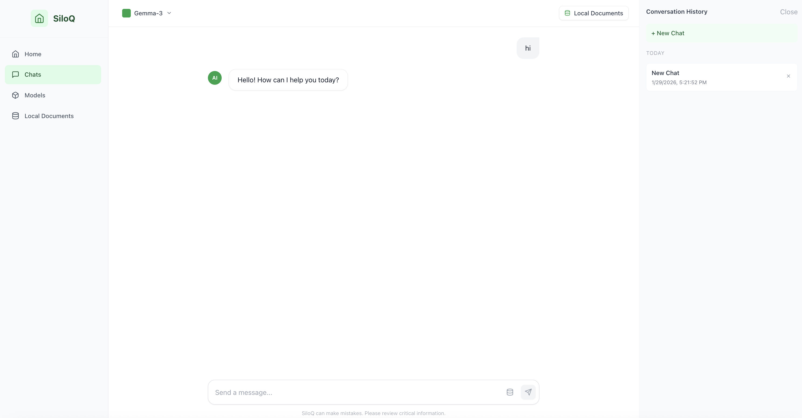
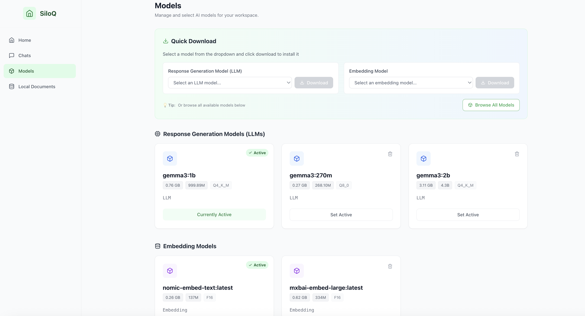
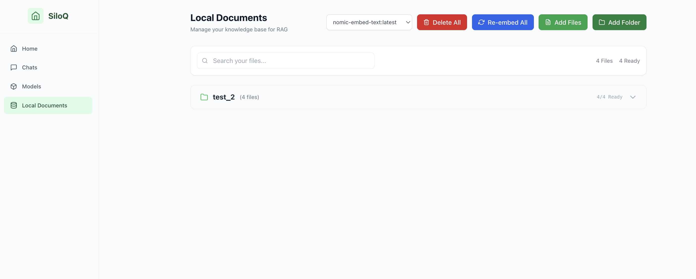

# 🤖 Your Personal Assistant

[](https://www.python.org/)
[](https://fastapi.tiangolo.com/)
[](https://nextjs.org/)
[](https://www.docker.com/)

Your AI-powered local RAG assistant for chatting with your documents

[Features](#-features) • [Demo](#-demo) • [Architecture](#️-architecture) • [Quick Start](#-quick-start) • [Docker](#-docker)

---

## ✨ Features

- 📄 **Multi-Format Support** — Upload PDFs, text files, and markdown documents
- 🤖 **AI-Powered Chat** — Ask questions and get answers from your documents
- 🔍 **Hybrid Search** — Combines semantic and keyword search (BM25) for better results
- 💾 **Conversation History** — Keep track of your chat sessions
- 🔒 **Privacy-First** — Everything runs locally, no cloud services or API keys needed
- ⚡ **Real-Time Streaming** — Get responses as they're generated
- 🎯 **Background Processing** — Celery workers handle document indexing efficiently

---


## 🎬 Demo

### Chats
<p align="center">
  
</p>

### Models
<p align="center">
  
</p>

### Local Documents
<p align="center">
  
</p>


---

## 🏗️ Architecture

```
┌──────────────────┐     ┌──────────────────┐     ┌──────────────────┐
│   Next.js UI     │────▶│  FastAPI Backend │────▶│  Ollama (Local)  │
│  (port 3000)     │     │   (port 8002)    │     │  Gemma 3 + Embed │
└──────────────────┘     └────────┬─────────┘     └──────────────────┘
                                  │
                     ┌────────────┼────────────┐
                     ▼            ▼            ▼
               ┌──────────┐ ┌──────────┐ ┌──────────┐
               │  Qdrant  │ │PostgreSQL│ │  Redis   │
               │ (Vectors)│ │(Metadata)│ │(History) │
               └──────────┘ └──────────┘ └──────────┘
                     ▲
                     │
               ┌──────────┐
               │  Celery  │
               │ (Workers)│
               └──────────┘
```

### Tech Stack

| Component | Technology |
|-----------|-----------|
| Frontend | Next.js 14, TypeScript, Tailwind CSS |
| Backend | FastAPI, Python 3.11+, LangChain |
| AI/ML | Ollama (Gemma 3 1B), nomic-embed-text |
| Vector DB | Qdrant |
| Databases | PostgreSQL, Redis |
| Task Queue | Celery |
| Infrastructure | Docker, Docker Compose |

---

## ⚠️ Common Issues & Quick Fixes

| Issue | Quick Fix |
|-------|-----------|
| 🔴 Models not showing in UI | `ollama list` → verify models installed → `docker-compose restart fastapi` |
| 🔴 Files stuck "Embedding in progress" | `docker-compose up -d celery-worker` → check `docker logs chat-celery-worker` |
| 🔴 "Connection refused" to Ollama | Ollama must run on **host**, not Docker → `ollama serve` → use `host.docker.internal:11434` |
| 🔴 Chat shows "No Model Installed" | Install models via UI at http://localhost:3000/models |
| 🔴 Port 3000 already in use | `lsof -ti:3000 \| xargs kill -9` or change port in docker-compose.yml |
| 🔴 Out of memory | Use `gemma3:270m` (292MB) instead of larger models |
| 🔴 Frontend not updating | Run locally: `cd front_end && npm install && npm run dev` |

Full troubleshooting guide in [🔧 Troubleshooting](#-troubleshooting) section below.

---

## 🚀 Quick Start

### Prerequisites

- **Docker Desktop** installed and running
- **[Ollama](https://ollama.ai/)** installed locally on your host machine
- **8GB RAM** minimum (16GB recommended)
- **10GB disk space** for models and data
- **macOS, Linux, or Windows** with WSL2

### 1. Install Ollama & Pull Models

Ollama must be running on your **host machine** (not in Docker):

```bash
# Install Ollama (macOS)
brew install ollama

# Or download from https://ollama.ai

# Start Ollama server
ollama serve

# Pull required models (in a new terminal)
ollama pull gemma3:1b          # 815MB - Response generation
ollama pull nomic-embed-text   # 274MB - Document embeddings

# Verify models are installed
ollama list
```

**Important:** Ollama should show both models before proceeding!

### 2. Clone & Setup

```bash
git clone https://github.com/sanchitshaleen/your-personal-assistant.git
cd your-personal-assistant
```

### 3. Start All Services

```bash
# Start all containers
docker-compose up -d

# Wait 30 seconds for services to initialize, then verify
docker-compose ps
```

**Expected output:** All services should be "healthy" or "running"
- ✅ postgres (healthy)
- ✅ redis (healthy)
- ✅ qdrant (healthy)
- ✅ fastapi (running)
- ✅ celery-worker (running)
- ✅ frontend (healthy)

### 4. Access the Application

Open your browser to:
- 🎨 **Frontend:** http://localhost:3000
- 🔧 **API Docs:** http://localhost:8002/docs
- 📊 **Redis UI:** http://localhost:8083
- 🌺 **Celery Monitor:** http://localhost:5555

### 5. Install AI Models via UI

1. Navigate to http://localhost:3000/models
2. Use the **Quick Download** dropdowns to select and install:
   - **Response Generation Model (LLM):** Choose Gemma 3 1B (recommended)
   - **Embedding Model:** Choose Nomic Embed Text (recommended)
3. Wait for downloads to complete
4. Models marked with ✓ are ready to use!

### 6. Start Chatting!

1. Go to http://localhost:3000/dashboard
2. Upload your documents (PDFs, TXT, MD)
3. Wait for "Embedding in progress..." to complete (shown on each file)
4. Go to http://localhost:3000/chat
5. Ask questions about your documents!

---

## 🔍 Verification Checklist

After setup, verify everything is working:

```bash
# 1. Check Ollama is accessible from Docker
docker exec chat-fastapi curl -s http://host.docker.internal:11434/api/tags | grep -q "gemma3" && echo "✅ Ollama connected" || echo "❌ Ollama not accessible"

# 2. Check models are loaded
curl http://localhost:8002/models | jq '.models | length'
# Should return: 2 or more

# 3. Check Celery worker is ready
docker logs chat-celery-worker 2>&1 | grep -q "ready" && echo "✅ Celery ready" || echo "❌ Celery not ready"

# 4. Check database connections
curl http://localhost:8002/ | jq
# Should return: {"status":"healthy"}
```

---

## ⚙️ Configuration

### Critical Environment Variables

The following environment variables **must be set** in `docker-compose.yml` for proper operation:

```yaml
services:
  fastapi:
    environment:
      # Ollama connection (host machine)
      - OLLAMA_BASE_URL=http://host.docker.internal:11434
      
      # Database connections (Docker services)
      - POSTGRES_HOST=postgres
      - POSTGRES_USER=postgres
      - POSTGRES_PASSWORD=postgres
      - POSTGRES_DB=chat_db
      - REDIS_HOST=redis
      - REDIS_PORT=6379
      - QDRANT_HOST=qdrant
      - QDRANT_PORT=6333
      
      # Celery (background tasks) - REQUIRED!
      - CELERY_BROKER_URL=redis://redis:6379/0
      - CELERY_RESULT_BACKEND=redis://redis:6379/1
      
      # Search & caching
      - USE_BM25_SEMANTIC_HYBRID=true
      - SEMANTIC_CACHE_ENABLED=true
      
  celery-worker:
    environment:
      # Must match fastapi broker settings
      - CELERY_BROKER_URL=redis://redis:6379/0
      - CELERY_RESULT_BACKEND=redis://redis:6379/1
```

**⚠️ Important:** If `CELERY_BROKER_URL` is missing, file embeddings will fail with "Redis connection refused"!

### Model Configuration

Key settings in `config/settings.py`:

```python
# Models (default)
LLM_CHAT_MODEL_NAME = "gemma3:1b"        # 815MB, fast
EMB_MODEL_NAME = "nomic-embed-text:latest"  # 274MB

# Retrieval
DOCS_NUM_COUNT = 3                        # Chunks per query
USE_BM25_SEMANTIC_HYBRID = True           # Hybrid search on/off

# Databases
QDRANT_HOST = "qdrant"
QDRANT_PORT = 6333
POSTGRES_HOST = "postgres"
REDIS_HOST = "redis"

# Ollama connection
OLLAMA_BASE_URL = "http://host.docker.internal:11434"
```

### Switching Models

The easiest way is through the UI at http://localhost:3000/models:
1. Use dropdowns to download different models
2. Click on installed model cards to "Set Active"
3. Changes take effect immediately

Or manually:
```bash
# Download a different LLM
ollama pull llama3:8b

# Update via API
curl -X POST http://localhost:8002/models/select \
  -H "Content-Type: application/json" \
  -d '{"name":"llama3:8b","type":"llm"}'

# Or edit config/settings.py:
LLM_CHAT_MODEL_NAME = "llama3:8b"

# Restart services
docker-compose restart fastapi celery-worker
```

---

## 📡 API Endpoints

**File Management:**
- `GET /uploads` - List user's files
- `POST /upload` - Upload file
- `DELETE /delete_file` - Delete file and embeddings
- `POST /embed` - Start embedding task
- `GET /embed/status/{task_id}` - Check progress

**Chat:**
- `POST /rag` - Chat with streaming (NDJSON)
- `POST /chat_history` - Get history
- `POST /clear_chat_history` - Clear history

**System:**
- `GET /` - Health check
- `GET /docs` - API documentation

Full docs at http://localhost:8002/docs when running.

---

## 🔧 Troubleshooting

### ❌ Services won't start

```bash
# Check status of all services
docker-compose ps

# View logs for specific service
docker-compose logs -f fastapi
docker-compose logs -f celery-worker

# Restart specific service
docker-compose restart fastapi

# Nuclear option - restart everything
docker-compose down && docker-compose up -d
```

### ❌ Ollama connection failed

**Error:** `model 'gemma3:1b' not found (status code: 404)` or `Connection refused`

**Root cause:** FastAPI container can't reach Ollama on host machine

**Fix:**
```bash
# 1. Verify Ollama is running on host
ollama list
# Should show: gemma3:1b, nomic-embed-text

# 2. Test Ollama is accessible from Docker
docker exec chat-fastapi curl -s http://host.docker.internal:11434/api/tags

# 3. If fails, check Ollama is listening on all interfaces
# Edit ~/.ollama/config (create if doesn't exist):
# OLLAMA_HOST=0.0.0.0

# 4. Restart Ollama
pkill ollama && ollama serve

# 5. Pull missing models
ollama pull gemma3:1b
ollama pull nomic-embed-text

# 6. Restart FastAPI
docker-compose restart fastapi celery-worker
```

### ❌ Files stuck at "Embedding in progress..." or "PENDING"

**Root cause:** Celery worker is not running or can't connect to Redis

**Fix:**
```bash
# 1. Check if Celery worker is running
docker ps | grep celery-worker
# Should show: chat-celery-worker

# 2. If not running, start it
docker-compose up -d celery-worker

# 3. Check worker logs for errors
docker logs chat-celery-worker --tail=50

# 4. Verify Redis connection
docker exec chat-celery-worker ping redis -c 1
# Should: PING redis (IP) 56(84) bytes of data.

# 5. Check if tasks are queued
docker exec chat-redis redis-cli LLEN celery
# If > 0, tasks are waiting

# 6. Restart both FastAPI and Celery with correct env vars
docker-compose down
docker-compose up -d

# 7. Re-trigger embedding via UI
# Go to http://localhost:3000/dashboard and re-upload file
```

### ❌ Models not showing in UI

**Root cause:** API not returning installed models correctly

**Fix:**
```bash
# 1. Check API response
curl http://localhost:8002/models | jq

# 2. Should return models array with installed models
# If empty or error, check Ollama connection (see above)

# 3. Verify model tags match
ollama list  # Shows: nomic-embed-text:latest
# Config should use: nomic-embed-text or nomic-embed-text:latest

# 4. Update config if needed
# Edit config/settings.py:
# EMB_MODEL_NAME = "nomic-embed-text:latest"

# 5. Restart services
docker-compose restart fastapi celery-worker
```

### ❌ Port already in use

**Error:** `Bind for 0.0.0.0:3000 failed: port is already allocated`

**Fix:**
```bash
# Find process using port
lsof -ti:3000

# Kill it
lsof -ti:3000 | xargs kill -9

# Or change port in docker-compose.yml
# Edit frontend service:
ports:
  - "3001:3000"  # Use 3001 instead

# Restart
docker-compose up -d
```

### ❌ Out of memory / Slow performance

**Symptoms:** System freezing, Docker crashing, slow responses

**Fix:**
```bash
# 1. Use smallest models
ollama pull gemma3:270m     # Only 292MB!
ollama pull nomic-embed-text

# 2. Update config/settings.py
LLM_CHAT_MODEL_NAME = "gemma3:270m"

# 3. Reduce chunk count for retrieval
DOCS_NUM_COUNT = 2  # Instead of 3

# 4. Limit Docker resources (create/edit docker-compose.override.yml):
services:
  fastapi:
    deploy:
      resources:
        limits:
          memory: 2G
  celery-worker:
    deploy:
      resources:
        limits:
          memory: 2G

# 5. Restart
docker-compose restart
```

### ❌ Frontend build errors or not updating

**Error:** `Error: Cannot find module '../server/require-hook'`

**Fix:**
```bash
# 1. Stop old container
docker stop chat-frontend
docker rm chat-frontend

# 2. Reinstall dependencies and run dev mode locally
cd front_end
rm -rf node_modules .next
npm install
npm run dev

# Frontend will now run on http://localhost:3000
# This is better for development anyway (hot reload works)
```

### ❌ Can't connect to database / Redis

**Error:** `Connection refused` or `pg_conn error`

**Fix:**
```bash
# 1. Check all services are healthy
docker-compose ps

# 2. Check network
docker network ls | grep chat_network

# 3. Restart databases
docker-compose restart postgres redis qdrant

# 4. Check logs
docker-compose logs postgres
docker-compose logs redis

# 5. Nuclear option - wipe data and restart
docker-compose down -v  # WARNING: Deletes all data!
docker-compose up -d
```

### ❌ Embedding fails with specific error

**Error in logs:** Check `docker logs chat-celery-worker`

**Common fixes:**
```bash
# 1. File not found
# Ensure volume mount is correct in docker-compose.yml:
volumes:
  - ./user_uploads:/fastAPI/user_uploads

# 2. Permission denied
chmod -R 755 user_uploads/

# 3. Model not found
ollama pull nomic-embed-text

# 4. Qdrant connection failed
docker-compose restart qdrant
# Wait 30 seconds for it to be healthy
docker-compose restart celery-worker
```

### 🧹 Clear everything and start fresh

```bash
# Stop all containers
docker-compose down

# Remove all data (⚠️ DESTRUCTIVE - you'll lose uploaded files!)
docker-compose down -v

# Remove images (optional)
docker-compose down --rmi all

# Start fresh
docker-compose up -d

# Wait for services to be ready
sleep 30

# Re-install models via UI at http://localhost:3000/models
```

### 🐛 Enable debug logging

```bash
# 1. Edit docker-compose.yml, add under fastapi service:
environment:
  - LOG_LEVEL=DEBUG
  - PYTHONUNBUFFERED=1

# 2. Restart
docker-compose restart fastapi

# 3. Watch logs in real-time
docker-compose logs -f fastapi celery-worker
```

### 💬 Still having issues?

1. Check existing [GitHub Issues](https://github.com/sanchitshaleen/your-personal-assistant/issues)
2. Create a new issue with:
   - Output of `docker-compose ps`
   - Output of `ollama list`
   - Relevant logs from `docker-compose logs`
   - Your OS and Docker version

---

## 🛠️ Tech Stack

**Backend:**
- FastAPI - API server
- LangChain - RAG orchestration
- Celery - Background tasks
- Python 3.11+

**Frontend:**
- Next.js 14 - React framework
- TypeScript
- Tailwind CSS

**Databases:**
- Qdrant - Vector storage
- PostgreSQL - File metadata
- Redis - Chat history & task queue

**AI:**
- Ollama - LLM server
- Gemma 3 1B - Language model
- nomic-embed-text - Embeddings

**Infrastructure:**
- Docker & Docker Compose

---

## 👨‍💻 Development

### Local development setup:

```bash
# Backend
python -m venv venv
source venv/bin/activate
pip install -r requirements.txt
uvicorn src.main:app --reload --port 8002

# Worker (separate terminal)
celery -A src.worker worker --loglevel=info

# Frontend (separate terminal)
cd front_end
npm install
npm run dev
```

### Running tests:
```bash
# Backend tests
pytest

# Check code formatting
black src/
flake8 src/
```

---

## 🔮 Roadmap

- [ ] **Cloud Drive Integration** — Connect to Google Drive, Dropbox, OneDrive for seamless document sync
- [ ] **Async Folder Monitoring** — Automatic detection of changes in source folders with triggered re-indexing
- [ ] **Multi-Modal Support** — Process images, audio, and video with vision and speech models
- [ ] **Knowledge Graphs support** — Knowledge graph visualization of document relationships


---

## 🤝 Contributing

Contributions are welcome! Feel free to submit issues and pull requests.

1. Fork the repository
2. Create your feature branch (`git checkout -b feature/amazing-feature`)
3. Commit your changes (`git commit -m 'Add some amazing feature'`)
4. Push to the branch (`git push origin feature/amazing-feature`)
5. Open a Pull Request

---

## 📄 License

GNU General Public License v3.0 - see [LICENSE](LICENSE) file.

- Free to use, modify, and distribute
- Derivative works must be open-source (GPL v3.0)
- Commercial use allowed with attribution

---

Built with ❤️ by [Sanchit Shaleen](https://github.com/sanchitshaleen)

